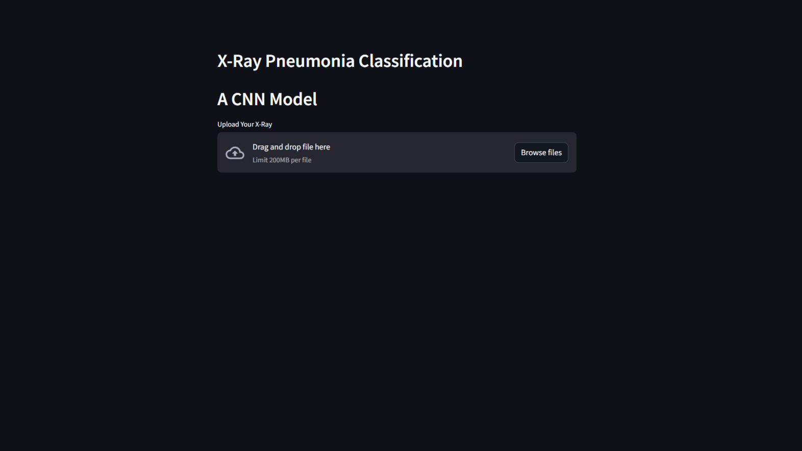
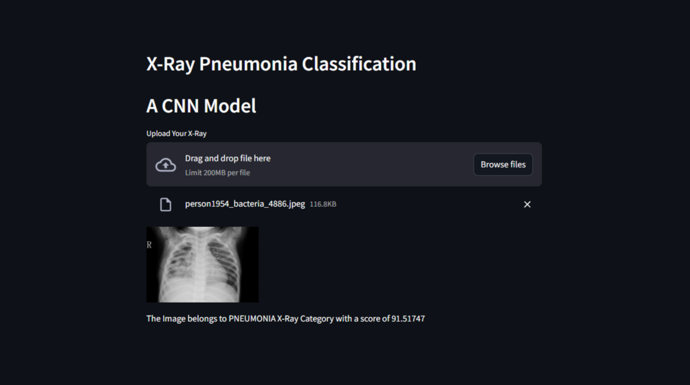
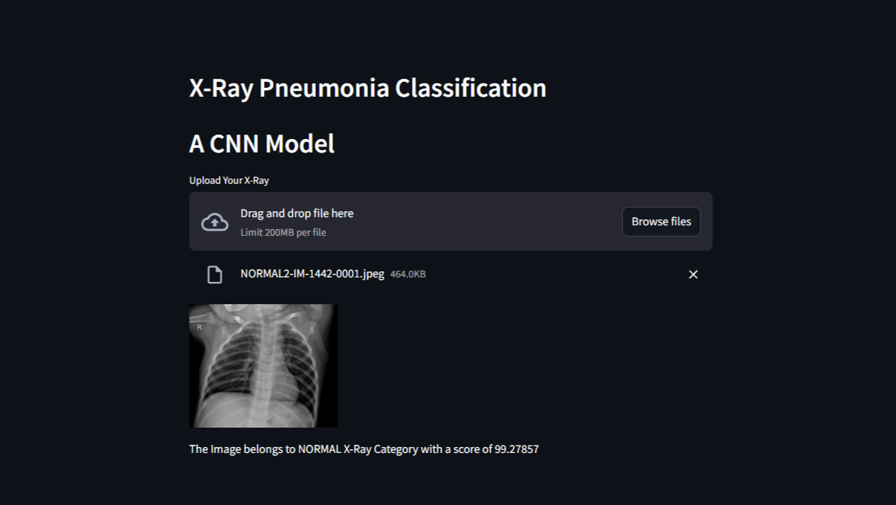

<h1> X-Ray Pneumonia Classification Project </h1>

# Overview

This project focuses on classifying chest X-ray images into two categories: Normal and Pneumonia , using Convolutional Neural Networks (CNNs). The goal is to assist medical professionals in diagnosing pneumonia from X-ray images with high accuracy.

The project explores three different approaches to address the data imbalance issue between the normal and pneumonia classes:

1. **SMOTE-based Approach** : Applied SMOTE to balance the dataset before training the CNN model.
2. **Imbalanced Dataset Approach** : Trained the CNN model directly on the imbalanced dataset without addressing the imbalance.
3. **Balanced Dataset Approach** : Balanced the dataset by taking an equal number of images from both classes.

Additionally, created a Streamlit web application to allow users to upload X-ray images and receive classification in real-time. Uploaded images are stored in a dedicated folder for further/future analysis.

# Key Results

- **SMOTE-Based Approach**:
    - Validation Accuracy on test dataset : 0.8205128312110901
    - Accuracy_Score on test dataset : 0.8205
    - Precision : 0.94551
    - Recall : 0.75641
    - F1 Score:  0.84045584
    - Confusion Matrix : TN: 217, FP: 17, FN: 95, TP: 295

- **Imbalanced Dataset Approach**:
    - Validation Accuracy on test dataset : 0.8462
    - Accuracy_Score on test dataset : 0.5545
    - Precision : 0.6172
    - Recall : 0.7564
    - F1 Score : 0.6797
    - Confusion Matrix : TN: 51, FP: 183, FN: 95, TP: 295

- **Balanced  Dataset Approach**:
    - Validation Accuracy : 0.9516
    - Accuracy Score : 0.9516
    - Precision : 0.9535
    - Recall : 0.9441
    - F1 Score : 0.9488
    - Confusion Matrix: TN: 322, FP: 14, FN: 17, TP: 287

# Installation and Setup

1. Python
2. Numpy
3. tensorflow
4. matplotlib
5. scikit-learn
6. streamlit
7. keras
8. imblearn
9. cv2

# Streamlit Web Interface
* Streamlit application allows users to upload X-ray images and view classification results in real-time.
* Uploaded images are stored in a dedicated folder `(uploads)` for record-keeping

# Challenges and Solutions
- **Data Imbalance**:
    - Issue: The dataset had significantly more pneumonia images than normal images
    - Solution: Explored three approaches—SMOTE, imbalanced dataset training, and Balanced Dataset Approach to address the imbalance.
- **Overfitting**:
    - Issue: The model tended to overfit on the training data.
    - Solution: Applied techniques like dropout, batch normalization, and data augmentation to improve generalization.  
- **Real-Time Predictions**:
    - Issue: Needed a user-friendly interface for uploading images and viewing predictions.
    - Solution: Developed a Streamlit web application to provide a seamless user experience.

# Streamlit X-Ray Pneumonia Classification WebPage Images 

## HomePage :

## Pneumonia Result :

## Normal Result :

# Conclusion
The CNN X-Ray Pneumonia Classification project successfully classifies X-Ray images for pneumonia detection using different approaches to handle data imbalance. The integration with Streamlit provides an intuitive interface for users to interact with the model and classify images. By addressing issues like data imbalance and implementing thorough evaluation metrics, the project ensures robust and reliable predictions.

# Contributions
Please Feel free to contribute to this project by submitting issues or pull requests.

Any enhancements, bug fixes, or optimizations are extremely welcomed!

